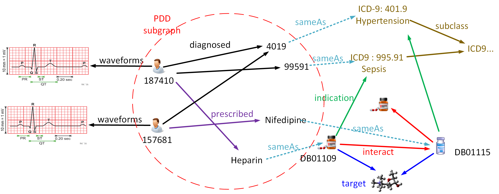

# HomePage

http://kmap.xjtudlc.com/pdd


# Patient Disease Drug Graph


#### [中文介绍传送门-Chinese Introduction Portal](readme-zh.md)

This is the display project of the drug database. The use of spring-boot made url redirect, the front end of the use of thymeleaf as MVC model to pass the data receiver.

## Introduction to data set

The data set is rdf data set, on the physical therapy, which has a diagnosis, medication, etc., web online display only shows a part of the data, download the `nt` format data, you can get a `complete data set`.

Using these data sets, you can perform sparql queries, perform entity relationship identification, perform medical data mining, and so on.

So what is `important` is this data set ，not this project！

## What is PDD Graph 

What is PDD Graph (Patient-Disease-Drug Graph):

Electronic medical records contain multi-format electronic medical data that consist of an abundance of medical knowledge. Facing with patients symptoms, experienced caregivers make right medical decisions based on their professional knowledge that accurately grasps relationships between symptoms, diagnosis, and treatments. We aim to capture these relationships by constructing a large and high-quality heterogeneous graph linking patients, diseases, and drugs (PDD) in EMRs.

Specifically, we extract important medical entities from MIMIC-III (Medical Information Mart for Intensive Care III) and automatically link them with the existing biomedical knowledge graphs, including ICD-9 ontology and DrugBank. The PDD graph presented is accessible on the Web via the SPARQL endpoint, and provides a pathway for medical discovery and applications, such as effective treatment recommendations.

A subgraph of PDD is illustrated in the followng figure to betterunderstand the PDD graph.



## Download

[Home page to konw how to download](http://kmap.xjtudlc.com/pdd/)

Server bandwidth is limited, it is recommended to Datahub download.


## This Project Technology

not data set

- spring-boot
- thymeleaf
- jquery

## Example

When you want to query out an entity, click directly to see what the entity is. E.g:


In [Patient-Disease-Drug Data Set](http://kmap.xjtudlc.com/pdd/dataset.html?tab=query&ds=/pdd)，Can be online inquiries, you can see the data as follows:


When we click on one of the data,E.g:[http://kmap.xjtudlc.com/pdd_data/resource/145834](http://kmap.xjtudlc.com/pdd_data/resource/145834) , you can see what the current system shows:


## Core code

```
    @GetMapping("/**/*")
    public String index(Model model , HttpServletRequest request) {
        String subject = String.valueOf(request.getRequestURL());
        model.addAttribute("subject",subject);
        return "/index";
    }
```

## License
[](http://creativecommons.org/licenses/by/4.0/) This work is licensed under a [Creative Commons Attribution 4.0 International License](http://creativecommons.org/licenses/by/4.0/).

